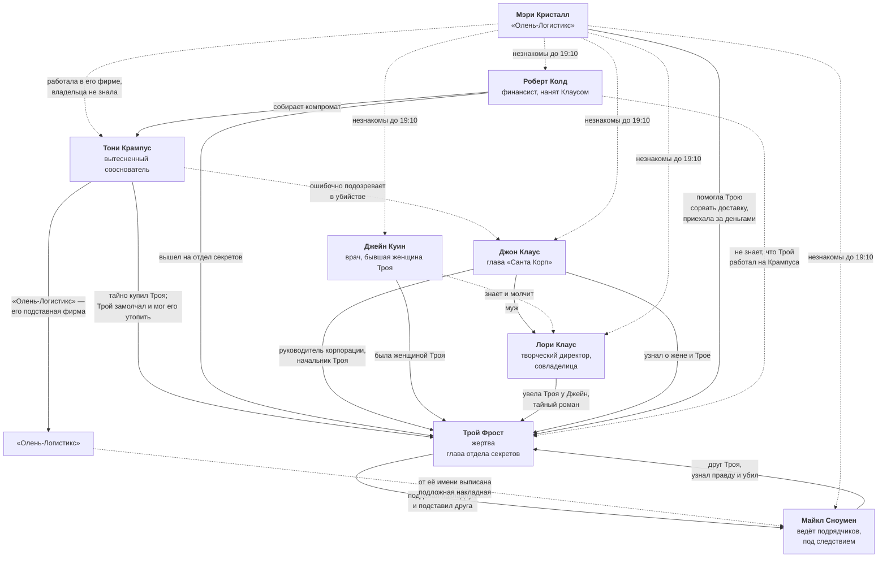

# Связи персонажей

Карта отношений между героями. Файл обновляется каждый раз, когда утверждается новая связь.

**Обозначения на схеме:**

- **Сплошная линия** — связь утверждена.
- **Пунктирная линия** — связь предполагается или ещё не определена.
- **⚠️** — предварительное решение, не является установленным лором.

## Схема

## Кто как оказался в доме

| Герой | Как попал на ужин |
|---|---|
| Джон Клаус | Приглашён Троем лично. |
| Лори Клаус | Приглашена Троем лично. |
| Джейн Куин | Приглашена Троем лично. |
| Майкл Сноумен | Приглашён Троем лично и позван приехать раньше остальных. |
| Роберт Колд | Взят с собой Джоном Клаусом. |
| Тони Крампус | **Не приглашён никем.** Приехал сам; все считают его гостем Троя, и опровергнуть это некому. |
| Мэри Кристалл | Не приглашена. Приехала за вознаграждением через отдельный вход. |

## Утверждённые связи

| Кто | С кем | Характер связи |
|---|---|---|
| Тони Крампус | Трой Фрост | Тайно купил главу отдела секретов. Это и есть секрет, о котором не знал даже Клаус. **Мотив:** Колд подбирался, Трой замолчал и мог его утопить. Крампус приехал давить и не застал живым. |
| Трой Фрост | Майкл Сноумен | Многолетняя дружба. Трой подделал накладную с подписью Майкла, чтобы отвести от себя вину за срыв доставки, и сам же ведёт внутреннее расследование. Майкл под следствием, исход не решён. |
| Майкл Сноумен | Трой Фрост | Убийца. Ехал к другу за помощью, зная, что подпись поддельная, но не зная кем. Услышал признание и отказ спасать — и ударил в аффекте. Убийство не планировалось. |
| Джон Клаус | Трой Фрост | Руководитель корпорации и его подчинённый. Не знал ни о работе Троя на Крампуса, ни о романе жены. |
| Джон Клаус | Лори Клаус | Муж и жена. |
| Джейн Куин | Трой Фрост | Была женщиной Троя. Лори увела его у неё; Джейн знает об этом и молчит. Ложный мотив — ревность и унижение. |
| Лори Клаус | Трой Фрост | Тайный роман. Лори увела Троя у Джейн и скрывает связь от мужа. Ложный мотив — страх разоблачения. |
| Джон Клаус | Трой Фрост | Узнал о романе жены с Троем. Ложный мотив, направленный прямо на жертву; при этом Крампус весь вечер давит именно на Клауса. |
| Джейн Куин | Лори Клаус | Соперницы. Джейн знает про роман, Лори не знает, что Джейн знает. |
| Тони Крампус | Джон Клаус | Сооснователи «Санта Корп». Клаус вытеснил Крампуса из компании — отсюда вражда и весь заказ против корпорации. |
| Джон Клаус | Роберт Колд | Клаус нанял Колда, финансиста и знатока документов, чтобы найти на Крампуса зацепку, пригодную для суда. |
| Мэри Кристалл | Трой Фрост | Работала в «Олень-Логистикс» и помогла Трою сорвать рождественскую доставку. Приехала за обещанным вознаграждением. Трой сам дал ей адрес и указал отдельный вход. |
| Мэри Кристалл | Тони Крампус | Незнакомы. Мэри не знала, что за саботажем стоит Крампус, и считала заказчиком самого Троя. «Олень-Логистикс», где она работала, — подставная фирма Крампуса, но владельца она не знала. |
| Майкл Сноумен | Тони Крампус | Прямой связи нет. Крампус заказал саботаж, но не знает, что вину повесили именно на Майкла, — поэтому не может вычислить убийцу. |
| Роберт Колд | Тони Крампус | Собирает доказательства против Крампуса по заказу Клауса. |
| Роберт Колд | Трой Фрост | Бумажный след Крампуса вывел Колда к отделу секретов. **Мотив:** несколько лет назад Колд уже пытался свалить Крампуса и разгромно проиграл — улики исчезли, он потерял репутацию. Теперь понял, что зачистил следы именно Трой. Скрывает, что подозревал жертву. |
| Тони Крампус | Джон Клаус | Крампус был уверен, что Трой собирается сдаться Клаусу, о разговоре с Майклом не знал. После убийства искренне подозревает Клауса и давит на него — активный ложный след. |
| Мэри Кристалл | Все шесть гостей | Незнакомы. Гости впервые видят Мэри в 19:10, поэтому первое подозрение падает на неё. |

## Мотивы против Троя

Каждый ложный след направлен именно на жертву — иначе он не делает героя подозреваемым.

| Герой | Мотив желать Трою смерти |
|---|---|
| Джон Клаус | Роман жены с Троем. |
| Лори Клаус | Трой мог раскрыть роман: при разводе она теряет свою долю в компании. |
| Джейн Куин | Трой бросил её ради Лори. |
| Майкл Сноумен | Трой вёл расследование саботажа и топил его. **Самый громкий мотив в комнате** — верный по форме, неверный по сути. |
| Тони Крампус | Трой замолчал и, пока Колд подбирается, мог утопить его показаниями. |
| Роберт Колд | Трой зачистил улики в его прошлом деле и стоил ему репутации. Личная месть. |
| Мэри Кристалл | Трой был должен ей вознаграждение и мог не заплатить, а то и сдать её как исполнительницу. |

## Личные цели на вечер

| Герой | Цель |
|---|---|
| Джон Клаус | Не дать роману жены вскрыться при всех и не позволить Крампусу использовать смерть Троя против корпорации. |
| Лори Клаус | Чтобы о романе не узнали. |
| Джейн Куин | Понять, чем на самом деле был для Троя её роман и что было между ним и Лори, сохранив лицо. |
| Майкл Сноумен | Не быть разоблачённым и добиться закрытия дела о саботаже. |
| Тони Крампус | Найти и уничтожить всё, что связывает его с Троем. |
| Роберт Колд | Добраться до бумаг Троя первым: смерть свидетеля превращает их в единственный шанс. |
| Мэри Кристалл | Получить свои деньги и не попасть под дело о саботаже. |

Колд и Крампус хотят одного и того же — бумаг Троя, только один чтобы обнародовать, другой чтобы уничтожить. Это центральный конфликт вечера помимо самого убийства.

## Не определено

| Кто | С кем | Что предстоит решить |
|---|---|---|
| Лори Клаус | Все прочие | Кто ещё знает о её романе с Троем. |
| Майкл Сноумен | Все прочие | Какую «невинную» тайну он скрывает помимо убийства. |
| Джейн Куин | Прочие гости | Отношения Джейн с остальными помимо Троя и Лори. |

## Что предстоит определить на этапе 4

- Профессию Джейн Куин помимо её роли в треугольнике.
- Насколько далеко продвинулось следствие по делу Майкла и кто в корпорации его ведёт.
- Как Крампус узнал о готовящемся признании Троя.
- Зачем Крампусу понадобился срыв рождественской доставки.
- Кто из гостей знает о романе Лори и Троя, кроме Джейн и Клауса.
- Как именно Крампус узнал о встрече, на которую его не звали.
