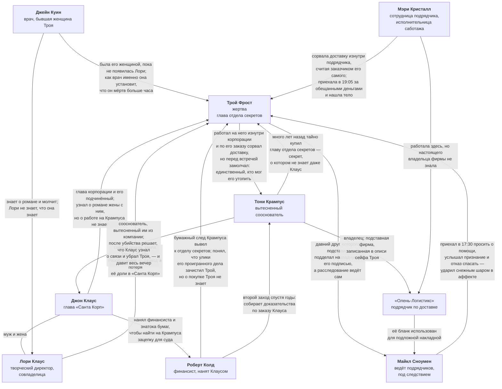

# Связи персонажей

Карта отношений между героями. Файл обновляется каждый раз, когда утверждается новая связь.

**Обозначения на схеме:**

- **Сплошная линия** — связь утверждена.
- **Пунктирная линия** — связь предполагается или ещё не определена.
- **⚠️** — предварительное решение, не является установленным лором.

## Схема

На схеме показаны только содержательные связи. То, что Мэри Кристалл не знакома ни с кем из шести гостей до 19:10, отражено в таблице ниже — линиями это выродилось бы в шесть одинаковых стрелок.

## Кто как оказался в доме

| Герой | Как попал на ужин |
|---|---|
| Джон Клаус | Приглашён Троем лично. |
| Лори Клаус | Приглашена Троем лично. |
| Джейн Куин | Приглашена Троем лично. |
| Майкл Сноумен | Приглашён Троем лично и позван приехать раньше остальных. |
| Роберт Колд | Взят с собой Джоном Клаусом. |
| Тони Крампус | **Не приглашён никем.** Приехал сам; все считают его гостем Троя, и опровергнуть это некому. |
| Мэри Кристалл | Не приглашена. Приехала за вознаграждением через отдельный вход. |

## Утверждённые связи

| Кто | С кем | Характер связи |
|---|---|---|
| Тони Крампус | Трой Фрост | Тайно купил главу отдела секретов. Это и есть секрет, о котором не знал даже Клаус. **Мотив:** Колд подбирался, Трой замолчал и мог его утопить. Крампус приехал давить и не застал живым. |
| Трой Фрост | Майкл Сноумен | Многолетняя дружба. Трой подделал накладную с подписью Майкла, чтобы отвести от себя вину за срыв доставки, и сам же ведёт внутреннее расследование. Майкл под следствием, исход не решён. |
| Майкл Сноумен | Трой Фрост | Убийца. Ехал к другу за помощью, зная, что подпись поддельная, но не зная кем. Услышал признание и отказ спасать — и ударил в аффекте. Убийство не планировалось. |
| Джон Клаус | Трой Фрост | Руководитель корпорации и его подчинённый. О работе Троя на Крампуса не знает. О романе жены с Троем узнал — это ложный мотив, направленный прямо на жертву; при этом Крампус весь вечер давит именно на Клауса. |
| Джон Клаус | Лори Клаус | Муж и жена. |
| Джейн Куин | Трой Фрост | Была женщиной Троя. Лори увела его у неё; Джейн знает об этом и молчит. Ложный мотив — ревность и унижение. |
| Лори Клаус | Трой Фрост | Тайный роман. Лори увела Троя у Джейн и скрывает связь от мужа. Ложный мотив — страх разоблачения. |
| Джейн Куин | Лори Клаус | Соперницы. Джейн знает про роман, Лори не знает, что Джейн знает. |
| Тони Крампус | Джон Клаус | Сооснователи «Санта Корп». Клаус вытеснил Крампуса из компании — отсюда вражда и весь заказ против корпорации. Крампус был уверен, что Трой собирается сдаться Клаусу, о разговоре с Майклом не знал, поэтому после убийства искренне подозревает Клауса и давит на него — активный ложный след. |
| Джон Клаус | Роберт Колд | Клаус нанял Колда, финансиста и знатока документов, чтобы найти на Крампуса зацепку, пригодную для суда. |
| Мэри Кристалл | Трой Фрост | Работала в «Олень-Логистикс» и помогла Трою сорвать рождественскую доставку. Приехала за обещанным вознаграждением. Трой сам дал ей адрес и указал отдельный вход. |
| Мэри Кристалл | Тони Крампус | Незнакомы. Мэри не знала, что за саботажем стоит Крампус, и считала заказчиком самого Троя. «Олень-Логистикс», где она работала, — подставная фирма Крампуса, но владельца она не знала. |
| Майкл Сноумен | Тони Крампус | Прямой связи нет. Крампус заказал саботаж, но не знает, что вину повесили именно на Майкла, — поэтому не может вычислить убийцу. |
| Роберт Колд | Тони Крампус | Собирает доказательства против Крампуса по заказу Клауса. |
| Роберт Колд | Трой Фрост | Бумажный след Крампуса вывел Колда к отделу секретов. **Мотив:** несколько лет назад Колд уже пытался свалить Крампуса и разгромно проиграл — улики исчезли, он потерял репутацию. Теперь понял, что зачистил следы именно Трой. Скрывает, что подозревал жертву. |
| Мэри Кристалл | Все шесть гостей | Незнакомы. Гости впервые видят Мэри в 19:10, поэтому первое подозрение падает на неё. |
| Лори Клаус | Прочие гости | О романе Лори и Троя знают только двое: Джейн Куин и Джон Клаус. Остальные гости не знают. |
| Майкл Сноумен | Прочие гости | Отдельной «невинной» тайны у Майкла нет: его видимый мотив — расследование саботажа, и он же самый громкий в комнате. |

## Мотивы против Троя

Каждый ложный след направлен именно на жертву — иначе он не делает героя подозреваемым.

| Герой | Мотив желать Трою смерти |
|---|---|
| Джон Клаус | Роман жены с Троем. |
| Лори Клаус | Трой мог раскрыть роман: при разводе она теряет свою долю в компании. |
| Джейн Куин | Трой бросил её ради Лори. |
| Майкл Сноумен | Трой вёл расследование саботажа и топил его. **Самый громкий мотив в комнате** — верный по форме, неверный по сути. |
| Тони Крампус | Трой замолчал и, пока Колд подбирается, мог утопить его показаниями. |
| Роберт Колд | Трой зачистил улики в его прошлом деле и стоил ему репутации. Личная месть. |
| Мэри Кристалл | Трой был должен ей вознаграждение и мог не заплатить, а то и сдать её как исполнительницу. |

## Личные цели на вечер

| Герой | Цель |
|---|---|
| Джон Клаус | Не дать роману жены вскрыться при всех и не позволить Крампусу использовать смерть Троя против корпорации. |
| Лори Клаус | Чтобы о романе не узнали. |
| Джейн Куин | Понять, чем на самом деле был для Троя её роман и что было между ним и Лори, сохранив лицо. |
| Майкл Сноумен | Не быть разоблачённым и добиться закрытия дела о саботаже. |
| Тони Крампус | Найти и уничтожить всё, что связывает его с Троем. |
| Роберт Колд | Добраться до бумаг Троя первым: смерть свидетеля превращает их в единственный шанс. |
| Мэри Кристалл | Получить свои деньги и не попасть под дело о саботаже. |

Колд и Крампус хотят одного и того же — бумаг Троя, только один чтобы обнародовать, другой чтобы уничтожить. Это центральный конфликт вечера помимо самого убийства.

## Алиби и свидетели

Трой убит между 17:50 и 18:30, **до приезда гостей**. Поэтому алиби на 18:30–19:00 никого не выгораживают и не топят: они нужны, чтобы вскрыть ложь Майкла о том, что он приехал вместе со всеми.

| Герой | Когда появился | Кто это подтверждает | Слабое место |
|---|---|---|---|
| Майкл Сноумен | **На деле 17:30.** Утверждает, что вошёл в 18:47. | Только Тони Крампус — видел его на пороге. | Единственный свидетель сам врёт про своё приглашение. Никто не видел, как Майкл подъезжал. |
| Джейн Куин | 18:35, первой | Никто | С 18:35 до 18:45 она в доме одна. |
| Джон Клаус | 18:45 | Лори и Колд — ехали одной машиной | Взаимное алиби внутри одной семьи и одного найма. |
| Лори Клаус | 18:45 | Джон Клаус и Колд | То же. |
| Роберт Колд | 18:45 | Джон и Лори Клаус | В 18:55 поднимался к кабинету один и стучал в дверь. |
| Тони Крампус | 18:47 | Майкл Сноумен | Круговое алиби: Крампус подтверждает Майкла, Майкл — Крампуса. |
| Мэри Кристалл | 19:05, отдельным входом | Никто | Никто не видел её до 19:10, и она единственная была на втором этаже. |

Ключевые узлы:

- **Круговое алиби Майкла и Крампуса.** Двое подтверждают друг друга, и оба лгут — каждый о своём. Разобрать этот узел и значит выйти на раннюю встречу.
- **Стук Колда в 18:55.** Объясняет, почему тело пролежало до 19:10, доказывает, что дверь была закрыта, и ставит Колда одного у кабинета.
- **Одинокие десять минут Джейн.** Ложный след против той, кто позже устанавливает время смерти.

## Вклад в расследование

Критерий: герой влияет на расследование, если **владеет фактом из цепочки разгадки** — убери игрока, и цепочка рвётся. Ложного мотива и подозрительного поведения для этого недостаточно.

Цепочка: время смерти → записка и назначенные на те же полчаса встречи → журнал сейфа → подлог по запросу Крампуса → снежный шар под ёлкой → кто был в доме раньше всех.

| Герой | Чем владеет | Звено цепочки |
|---|---|---|
| Джейн Куин | Как врач устанавливает, что Трой мёртв больше часа. Без неё стол ищет убийцу среди тех, кто отлучался из холла в 19:00–19:10, и уходит не туда. | Время смерти |
| Мэри Кристалл | Трой назначил ей встречу на 18:30–19:00 — те самые полчаса из записки. Значит записка написана заранее и Трой рассчитывал быть живым. Она же знает, что заказчиком саботажа был сам Трой. | Записка, вина Троя в подлоге |
| Роберт Колд | Единственный, кто способен прочитать журнал сейфа и опись: понять, что подпись «воспроизведена», а «Олень-Логистикс» — подставная фирма. Без него ключевая улика остаётся набором строк. | Журнал сейфа |
| Тони Крампус | Знает, что Трой работал на него и что саботаж заказал он, — то есть знает о невиновности Майкла в подлоге. Скрывает это и весь вечер давит на Клауса. | Подлог по заказу Крампуса |
| Джон Клаус | Подтверждает, что Трой вёл расследование против Майкла и топил его, — это делает мотив Майкла публичным фактом, а не слухом. | Мотив Майкла |
| Майкл Сноумен | Убийца: ранний приезд, унесённая накладная, шар под ёлкой. | Все |
| Лори Клаус | **Своего факта нет.** Роман с Троем работает только как ложный след: он объясняет, почему Лори подозрительна, но ничего не даёт столу для разгадки. | — |

## Не определено

- **Чем владеет Лори Клаус из цепочки разгадки.** Единственный герой, чей вклад пока исчерпывается ложным следом. Решается отдельно.
- **Чем вынудить Тони Крампуса раскрыть свою связь с Троем.** Факт у него есть, но выдавать его добровольно незачем — нужен рычаг. Решается на этапе 6 вместе с уликами.

Пунктирных линий на схеме не осталось: все связи между героями утверждены. Открытые вопросы по мотивации Крампуса ведутся в файле [«Трой Фрост»](Трой%20Фрост/Трой%20Фрост.md) — на карту связей они не влияют.
