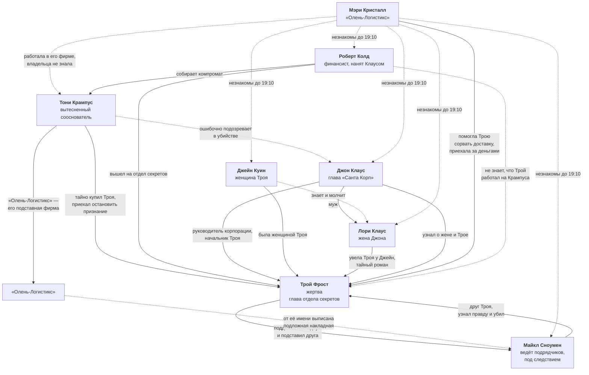

# Связи персонажей

Карта отношений между героями. Файл обновляется каждый раз, когда утверждается новая связь.

**Обозначения на схеме:**

- **Сплошная линия** — связь утверждена.
- **Пунктирная линия** — связь предполагается или ещё не определена.
- **⚠️** — предварительное решение, не является установленным лором.

## Схема

## Утверждённые связи

| Кто | С кем | Характер связи |
|---|---|---|
| Тони Крампус | Трой Фрост | Тайно купил главу отдела секретов. Это и есть секрет, о котором не знал даже Клаус. Узнал о готовящемся признании и приехал остановить Троя, но не застал его живым. |
| Трой Фрост | Майкл Сноумен | Многолетняя дружба. Трой подделал накладную с подписью Майкла, чтобы отвести от себя вину за срыв доставки. Майкл под следствием, исход не решён. |
| Майкл Сноумен | Трой Фрост | Убийца. Ехал к другу за помощью, зная, что подпись поддельная, но не зная кем. Услышал признание и отказ спасать — и ударил в аффекте. Убийство не планировалось. |
| Джон Клаус | Трой Фрост | Руководитель корпорации и его подчинённый. Не знал ни о работе Троя на Крампуса, ни о романе жены. |
| Джон Клаус | Лори Клаус | Муж и жена. |
| Джейн Куин | Трой Фрост | Была женщиной Троя. Лори увела его у неё; Джейн знает об этом и молчит. Ложный мотив — ревность и унижение. |
| Лори Клаус | Трой Фрост | Тайный роман. Лори увела Троя у Джейн и скрывает связь от мужа. Ложный мотив — страх разоблачения. |
| Джон Клаус | Трой Фрост | Узнал о романе жены с Троем. Ложный мотив, направленный прямо на жертву; при этом Крампус весь вечер давит именно на Клауса. |
| Джейн Куин | Лори Клаус | Соперницы. Джейн знает про роман, Лори не знает, что Джейн знает. |
| Тони Крампус | Джон Клаус | Сооснователи «Санта Корп». Клаус вытеснил Крампуса из компании — отсюда вражда и весь заказ против корпорации. |
| Джон Клаус | Роберт Колд | Клаус нанял Колда, финансиста и знатока документов, чтобы найти на Крампуса зацепку, пригодную для суда. |
| Мэри Кристалл | Трой Фрост | Работала в «Олень-Логистикс» и помогла Трою сорвать рождественскую доставку. Приехала за обещанным вознаграждением. Трой сам дал ей адрес и указал отдельный вход. |
| Мэри Кристалл | Тони Крампус | Незнакомы. Мэри не знала, что за саботажем стоит Крампус, и считала заказчиком самого Троя. «Олень-Логистикс», где она работала, — подставная фирма Крампуса, но владельца она не знала. |
| Майкл Сноумен | Тони Крампус | Прямой связи нет. Крампус заказал саботаж, но не знает, что вину повесили именно на Майкла, — поэтому не может вычислить убийцу. |
| Роберт Колд | Тони Крампус | Собирает доказательства против Крампуса по заказу Клауса. |
| Роберт Колд | Трой Фрост | Бумажный след Крампуса вывел Колда внутрь корпорации, к отделу секретов. Колд приехал дожать Троя и теперь скрывает, что подозревал жертву, — его собственная тайна. |
| Тони Крампус | Джон Клаус | Крампус был уверен, что Трой собирается сдаться Клаусу, о разговоре с Майклом не знал. После убийства искренне подозревает Клауса и давит на него — активный ложный след. |
| Мэри Кристалл | Все шесть гостей | Незнакомы. Гости впервые видят Мэри в 19:10, поэтому первое подозрение падает на неё. |

## Не определено

| Кто | С кем | Что предстоит решить |
|---|---|---|
| Джейн Куин | Все прочие | Профессия Джейн помимо роли в треугольнике и её отношения с остальными гостями. |
| Лори Клаус | Все прочие | Чем Лори занимается и кто ещё знает о её романе с Троем. |
| Все | Трой Фрост | Причина приглашения каждого из шести гостей. |

## Что предстоит определить на этапе 4

- Профессию Джейн Куин помимо её роли в треугольнике.
- Насколько далеко продвинулось следствие по делу Майкла и кто в корпорации его ведёт.
- Как Крампус узнал о готовящемся признании Троя.
- Зачем Крампусу понадобился срыв рождественской доставки.
- Кто из гостей знает о романе Лори и Троя, кроме Джейн и Клауса.
- Почему Трой пригласил каждого из шести гостей.
