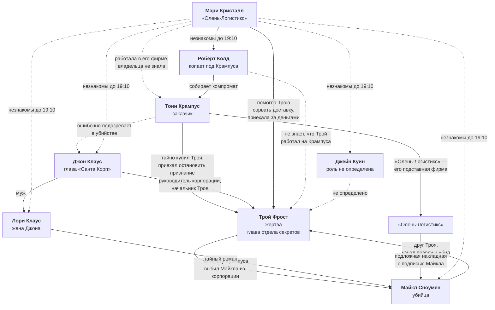

# Связи персонажей

Карта отношений между героями. Файл обновляется каждый раз, когда утверждается новая связь.

**Обозначения на схеме:**

- **Сплошная линия** — связь утверждена.
- **Пунктирная линия** — связь предполагается или ещё не определена.
- **⚠️** — предварительное решение, не является установленным лором.

## Схема

## Утверждённые связи

| Кто | С кем | Характер связи |
|---|---|---|
| Тони Крампус | Трой Фрост | Тайно купил главу отдела секретов. Это и есть секрет, о котором не знал даже Клаус. Узнал о готовящемся признании и приехал остановить Троя, но не застал его живым. |
| Трой Фрост | Майкл Сноумен | Многолетняя дружба. По заказу Крампуса Трой сфабриковал компромат и лишил Майкла его места в «Санта Корп», после чего продолжал оставаться ему другом. |
| Майкл Сноумен | Трой Фрост | Убийца. Трой позвал его приехать раньше остальных, чтобы наконец признаться. Майкл ударил в аффекте — убийство не планировалось. |
| Джон Клаус | Трой Фрост | Руководитель корпорации и его подчинённый. Не знал ни о работе Троя на Крампуса, ни о романе жены. |
| Джон Клаус | Лори Клаус | Муж и жена. |
| Лори Клаус | Майкл Сноумен | Тайный роман. Оба скрывают его и потому лгут о вечере — сильный ложный след. |
| Мэри Кристалл | Трой Фрост | Работала в «Олень-Логистикс» и помогла Трою сорвать рождественскую доставку. Приехала за обещанным вознаграждением. Трой сам дал ей адрес и указал отдельный вход. |
| Мэри Кристалл | Тони Крампус | Незнакомы. Мэри не знала, что за саботажем стоит Крампус, и считала заказчиком самого Троя. «Олень-Логистикс», где она работала, — подставная фирма Крампуса, но владельца она не знала. |
| Майкл Сноумен | Тони Крампус | Прямой связи нет, но именно через «Олень-Логистикс» была выписана подложная накладная, которой Трой выбил Майкла из корпорации. |
| Роберт Колд | Тони Крампус | Собирает доказательства против Крампуса. |
| Тони Крампус | Джон Клаус | Крампус был уверен, что Трой собирается сдаться Клаусу, о разговоре с Майклом не знал. После убийства искренне подозревает Клауса и давит на него — активный ложный след. |
| Мэри Кристалл | Все шесть гостей | Незнакомы. Гости впервые видят Мэри в 19:10, поэтому первое подозрение падает на неё. |

## Не определено

| Кто | С кем | Что предстоит решить |
|---|---|---|
| Джейн Куин | Все | Профессия, роль, связь с Троем и причина приглашения. |
| Роберт Колд | Трой Фрост | Знал ли Колд, что Трой работал на Крампуса, и как это связано с приглашением. |
| Тони Крампус | Джон Клаус | Кто такой Крампус для корпорации: конкурент, партнёр или человек изнутри. |
| Все | Трой Фрост | Причина приглашения каждого из шести гостей. |

## Что предстоит определить на этапе 4

- Профессию и общественную роль каждого героя, в первую очередь Джейн Куин.
- Какое место занимал Майкл в «Санта Корп» и как давно Трой его выбил.
- Чем Майкл занимается сейчас, после потери места, и почему принял приглашение Троя.
- Кто такой Тони Крампус и чего он добивался от «Санта Корп».
- Как Крампус узнал о готовящемся признании Троя.
- Зачем Крампусу понадобился срыв рождественской доставки.
- Тайну Джейн Куин, работающую как ложный мотив.
- Знает ли кто-нибудь из гостей о романе Лори и Майкла.
