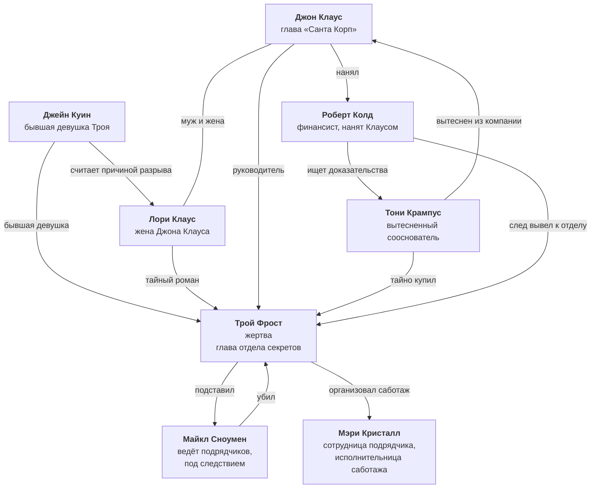

# Связи персонажей

Карта отношений между героями. Файл обновляется каждый раз, когда утверждается новая связь.

**Обозначения на схеме:**

- **Сплошная линия** — связь утверждена.
- **Пунктирная линия** — связь предполагается или ещё не определена.
- **⚠️** — предварительное решение, не является установленным лором.

## Схема

На схеме показаны только связи между людьми. Подписи намеренно сокращены; полные обстоятельства перечислены в таблице «Утверждённые связи».

**«Олень-Логистикс»** — подрядчик «Санта Корп» по доставке. Майкл ведёт работу с этим подрядчиком, Мэри работает внутри него, а Трой использовал его накладную, чтобы подделать подпись Майкла. Саботаж заказал Крампус, организовал Трой, а Мэри считала заказчиком самого Троя.

## Кто как оказался в доме

| Герой | Как попал на ужин |
|---|---|
| Джон Клаус | Приглашён Троем лично. |
| Лори Клаус | Приглашена Троем лично. |
| Джейн Куин | Приглашена Троем лично. |
| Майкл Сноумен | Приглашён Троем лично и позван приехать раньше остальных. |
| Роберт Колд | Позван Джоном Клаусом; приехал отдельно. |
| Тони Крампус | **Не приглашён никем.** Установил наблюдение за Троем, так узнал дату ужина и приехал сам. Все считают его гостем Троя, и опровергнуть это некому. |
| Мэри Кристалл | Не приглашена на ужин. Трой назначил ей тайную встречу и указал отдельный вход. |

## Утверждённые связи

| Кто | С кем | Характер связи |
|---|---|---|
| Тони Крампус | Трой Фрост | Много лет платил Трою вторую зарплату за работу изнутри «Санта Корп». За несколько дней до ужина Трой перестал выходить на связь. Крампус установил за ним наблюдение, узнал дату ужина и приехал без приглашения. |
| Трой Фрост | Майкл Сноумен | Многолетняя дружба. Трой подделал накладную с подписью Майкла, чтобы отвести от себя вину за срыв доставки, и сам вёл внутреннее расследование. Майкл оказался под следствием. |
| Майкл Сноумен | Трой Фрост | Убийца. Приехал раньше остальных по приглашению Троя, услышал признание в подлоге и отказ спасти его, после чего ударил Троя снежным шаром. Убийство не планировалось. |
| Джон Клаус | Трой Фрост | Руководитель корпорации и его подчинённый. Трой возглавлял отдел секретов. |
| Джон Клаус | Лори Клаус | Муж и жена. |
| Джейн Куин | Трой Фрост | Бывшая девушка Троя. Узнав о его романе с Лори, Джейн тайно сфотографировала пару. Через несколько месяцев Трой расстался с Джейн. |
| Лори Клаус | Трой Фрост | Тайный роман, который начался, когда Трой ещё был с Джейн. |
| Джейн Куин | Лори Клаус | Джейн считает Лори причиной их с Троем разрыва. Джейн знает о романе; Лори не знает, что Джейн известно. |
| Тони Крампус | Джон Клаус | Сооснователи «Санта Корп». Джон вытеснил Крампуса из компании, чем вызвана их вражда. |
| Джон Клаус | Роберт Колд | Джон нанял Колда, финансиста и знатока документов, чтобы найти доказательства против Крампуса, пригодные для суда. |
| Мэри Кристалл | Трой Фрост | По поручению Троя помогла сорвать рождественскую доставку и считала заказчиком самого Троя. Он обещал ей вознаграждение, сообщил адрес дома и назначил тайную встречу. |
| Роберт Колд | Тони Крампус | Несколько лет назад Колд безуспешно пытался разоблачить Крампуса. Теперь вновь собирает доказательства против него по поручению Джона. |
| Роберт Колд | Трой Фрост | Бумажный след Крампуса вывел Колда на отдел секретов. Трой догадался, что Колд приближается к его тайне, поднял из архива папку дела K-17 и оставил её на нижней полке стола. |
| Мэри Кристалл | Остальные гости | Остальные впервые видят Мэри в 19:10, когда она выбегает со второго этажа и сообщает о смерти Троя. |

## Матрица знаний и раскрытия

Служебная таблица фиксирует только прямо подтверждённые границы информации и не выдаётся игрокам.

| Герой | Знает | Скрывает или не сообщает сразу | Прямо установленная граница знаний | Когда факт выходит на стол |
|---|---|---|---|---|
| Джон | Что поручил Колду искать доказательства против Крампуса | Задачу Колда | — | Находит зажим без галстука; задача Колда выходит на стол при обсуждении его роли |
| Лори | О своём романе с Троем | Роман | Не знает, что Джейн известно о романе | После появления фотографий; также находит снежный шар и список приглашённых |
| Джейн | Что роман начался до её разрыва с Троем; что она тайно сфотографировала пару | Знание о романе: после расставания она молчала | — | Сообщает результат осмотра тела; позже находит недогоревшее письмо |
| Роберт | Историю дела K-17; что бумажный след Крампуса вывел его на отдел секретов | — | — | После появления папки K-17; затем находит журнал выемок с описью |
| Крампус | Что много лет платил Трою; что заказал саботаж; что узнал об ужине через наблюдение и пришёл без приглашения | Связь с Троем, заказ саботажа и отсутствие приглашения | — | Отсутствие в списке раскрывается уликой 7; остальные факты — при обсуждении его связи с Троем |
| Майкл | Что Трой подделал его подпись; полную правду об убийстве и сокрытии следов | Ранний приезд, убийство, галстук и накладную | Не знает о роли Крампуса: Трой не назвал заказчика | Не признаётся до итогового раскрытия |
| Мэри | Что помогла сорвать доставку; что Трой обещал вознаграждение и назначил тайную встречу | Прикосновение к телу и окровавленный платок | Считает заказчиком Троя | После письма и обнаружения платка; позже находит папку K-17 |

Знак «—» означает, что хронология не устанавливает отдельную границу знаний по этому пункту.

## Алиби и свидетели

Трой убит между 17:50 и 18:30, **до приезда остальных гостей**. Поэтому алиби на 18:30–19:00 никого само по себе не оправдывает и не обвиняет: оно помогает вскрыть ложь Майкла о времени его появления.

| Герой | Когда появился | Кто это подтверждает | Слабое место |
|---|---|---|---|
| Майкл Сноумен | **На деле 17:30.** Утверждает, что вошёл в 18:47. | Тони Крампус видел его на пороге в 18:47. | Никто не видел, как Майкл приехал в первый раз. До 18:47 он ждал в машине. |
| Джейн Куин | 18:35, первой из остальных гостей | В 18:40 её видит прибывший Колд. | С 18:35 до 18:40 она в доме одна. |
| Роберт Колд | 18:40, приехал один | Джейн уже находилась в холле. | В 18:55 поднимался к кабинету один и стучал в дверь. |
| Джон Клаус | 18:45 | Лори — они приехали вдвоём. | Взаимное алиби супругов. |
| Лори Клаус | 18:45 | Джон — они приехали вдвоём. | Взаимное алиби супругов. |
| Тони Крампус | 18:47 | Майкл Сноумен вошёл одновременно с ним. | Взаимное подтверждение касается только входа в 18:47. |
| Мэри Кристалл | ~19:05, отдельным входом | Никто | Никто не видел её до 19:10; она первой обнаружила тело. |

Ключевые узлы:

- **Одновременный вход Майкла и Крампуса.** Крампус подтверждает только появление Майкла на пороге в 18:47, но не время его первоначального приезда.
- **Стук Колда в 18:55.** Все пятеро в холле видят, как он поднимается к кабинету, стучит в закрытую дверь и возвращается.
- **Одинокие пять минут Джейн.** С 18:35 до приезда Колда в 18:40 она одна в доме; это создаёт ложный след против той, кто позже устанавливает время смерти.

## Вклад в расследование

В таблице указаны как сведения героев, так и улики, которые они вводят в игру.

| Герой | Чем владеет или что находит | Значение для расследования |
|---|---|---|
| Джейн Куин | Осматривает тело и устанавливает: один удар по голове сзади, смерть наступила больше часа назад. Позже находит недогоревшее письмо Троя к Мэри. | Определяет время и способ убийства; связывает Мэри с тайной встречей. |
| Тони Крампус | Находит в личном ящике Троя конверт с двумя фотографиями. | Раскрывает роман Троя и Лори и создаёт ложные мотивы. |
| Лори Клаус | Находит снежный шар с растёртой кровью, а позднее — список приглашённых без имени Крампуса. | Вводит орудие убийства и разоблачает незваного гостя. |
| Майкл Сноумен | Замечает окровавленный платок в сумке Мэри и просит его достать. Сам знает правду о раннем приезде, убийстве, галстуке и накладной. | Платок объясняет прикосновение Мэри к телу; скрытые сведения связывают убийцу со всей цепочкой. |
| Джон Клаус | Находит на рубашке Троя застёгнутый зажим без галстука. | Указывает на снятый и исчезнувший галстук. |
| Мэри Кристалл | После улики 7 ищет обещанное вознаграждение и находит на нижней полке стола папку дела K-17. | Возвращает в расследование старое дело Колда и бумажный след к отделу секретов. |
| Роберт Колд | После улики 8 находит рядом с закрытым сейфом журнал выемок с описью. | Показывает, что Трой вынул позицию 14 для «личной передачи», после чего документ исчез. |

Последняя улика не называет заказчика саботажа. Журнал с описью лежит рядом с закрытым сейфом; сам сейф после выемки закрыл Трой.

Пунктирных линий на схеме сейчас нет. Новые связи и границы знаний следует добавлять только после их утверждения в [«Хронологии»](Хронология.md).
